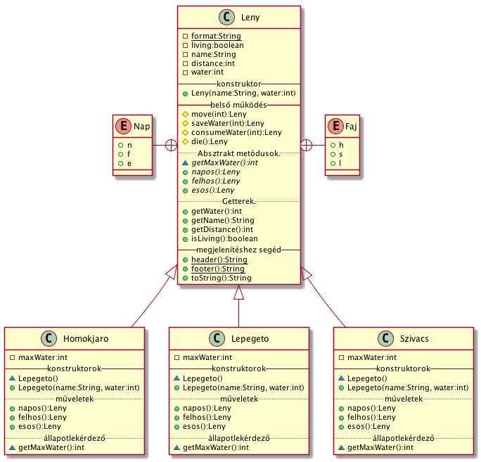

1. Feladat
==========

Egy többnapos versenyen lények vesznek részt. Ki nyeri a versenyt, azaz
melyik lény teszi meg a legnagyobb távolságot úgy, hogy közben **életben
marad?** Kezdetben minden lény valamennyi vízzel rendelkezik, és a
megtett távolsága 0. A verseny során háromféle nap lehetséges: *napos*,
*felhős* és *esős*. Ezekre a különböző fajtájú lények eltérő módon
reagálnak vizfogyasztás és haladás szempontjából. Minden lény először a
rendelkezésre álló víz mennyiségét változtatja meg, ezután ha tud,
mozog. Bármely lény elpusztul, ha a vize elfogy (0 lesz az érték),
ezután értelemszerűen semmilyen tevékenységre sem képes. Minden lény
jellemzői:

-   az **egyedi neve (string)**,
-   a **rendelkezésre álló víz mennyisége (egész)**,
-   a **maximálisan tárolható víz mennyisége (egész)**,
-   hogy **él-e (logikai)**,
-   illetve az **eddig megtett távolság (egész)**. A versenyen részt
    vevő lények fajtái a következők: `homokjáró, szivacs, lépegető`.

A következő táblázat tartalmazza az egyes fajták jellemzőit:

  fajta               víz változtatás                  távolság          max víz
  ----------- ------- ----------------- ------ ------- ---------- ------ ---------
              napos   felhős            esős   napos   felhős     esős   
  homokjáró   -1      0                 3      3       1          0      8
  szivacs     -4      -1                6      0       1          3      20
  lépegető    -2      -1                3      1       2          1      12

Az egyes lények a vízkészlet megváltoztatása során nem léphetik túl a
fajtára jellemző maximális értéket, legfeljebb azt érhetik el.

A program egy szövegfájlból olvassa be a verseny adatait! Az első sorban
az induló lények száma szerepel. A következő sorok tartalmazzák a lények
adatait szóközökkel elválasztva:
`a lény nevét, a fajtáját és a kezdetben a rendelkezésre álló víz mennyiségét`.
A fajtát egy karakter azonosít:
`h - homokjáró, s - szivacs, l - lépegető`.

A lényeket leíró részt követő sorban a verseny napjai szerepelnek egy
karaktersorozatban. Az egyes jelek értelmezése:
`n - napos, f - felhős, e - esős`.

A program kérje be a fájl nevét, majd jelenítse meg a nyertes nevét!
(Feltehetjük, hogy a fájl formátuma helyes) Egy lehetséges bemenet:

``` {.text}
4
Vandor h 4
Seta l 7
Csuszo s 12
Siklo s 10
nffeeennf
```

(Javaslat: Hozza létre az absztrakt lény osztályt, amelyből származtatja
a homokjáró, szivacs és lépegető osztályokat. A konstruktor paramétere
legyen a név és a kezdeti víz mennyisége. Vezessen be három műveletet a
napoknak *(napos, felhős, esős)* amelyek a vízfogyasztást az élet
vizsgálatával együtt, illetve mozgatják a lényt. A végeredmény
meghatározásához kell még 3 művelet:

-   él-e a lény,
-   a név illetve
-   a megtett távolság lekérdezése)

TODO \[\#A\] Megoldási terv
===========================

TODO Osztályok és kapcsolataik
------------------------------



TODO \[\#B\] A megoldáshoz szükséges típusok absztrakt leírása
==============================================================

TODO \[\#B\] Tesztelési terv
============================
